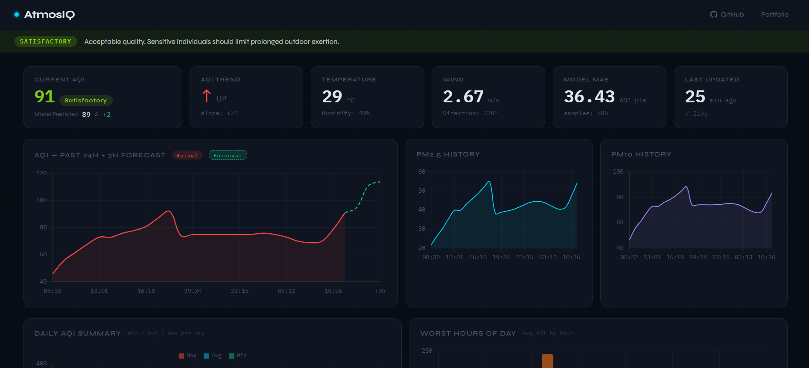
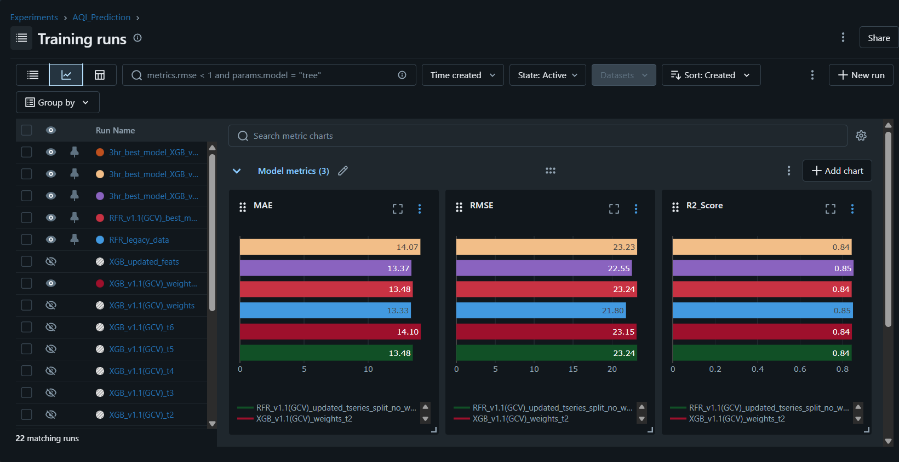

# AtmosIQ — Air Quality Prediction Dashboard

AtmosIQ is an end-to-end air quality monitoring and forecasting system that collects real-time pollution data, predicts future PM-based AQI using a machine learning model, and visualizes insights through a modern web dashboard.

The system is fully automated, scalable, and production-ready, combining GitHub Actions, Redis, Supabase, FastAPI, MLflow experiment tracking, and ML forecasting.

## 🚀 Live Demo

Dashboard: https://atmosiq.up.railway.app/



## Why PM-Based AQI


AtmosIQ calculates AQI using PM2.5 and PM10 only, reflecting real-world monitoring practices.

As shown above, public air-quality display boards in Mumbai primarily report PM2.5 and PM10, which usually dominate AQI values in urban Indian environments.

**Reasoning**
- PM2.5 & PM10 have the highest health impact
- They show the strongest correlation with AQI
- They are the most consistently available pollutants
- AQI is typically reported as the maximum PM sub-index

Including additional gases (NO₂, SO₂, CO, O₃) would reduce reliability due to sparse and inconsistent data.
AtmosIQ prioritizes accuracy, availability, and real-world relevance.

## Key Features

- Hourly automated data ingestion using GitHub Actions
- Rolling short-term memory using Redis (last 3 hours of sensor data)
- ML-based AQI prediction (3 hours ahead)
- MLflow experiment tracking — all training runs logged with MAE, RMSE and R² metrics for full model lineage
- Persistent historical storage in Supabase
- Redis-backed response caching shared across FastAPI workers
- Real-time dashboard with:
  - PM2.5 & PM10 trends
  - Current AQI with category and health advisory
  - Past 24h AQI history + 3h forecast chart
  - Weather conditions (temperature, humidity, wind)
  - Model MAE scorecard
  - Daily AQI summary and worst-hours-of-day analysis
- Dark industrial UI built with FastAPI + Chart.js
- Zero manual intervention once deployed

## System Architecture


```
OpenWeather API
        ↓
GitHub Actions (Cron Job, Hourly)
        ↓
Redis (Rolling 3-Hour Buffer)
        ↓
Feature Engineering + ML Prediction
        ↓
Supabase (Persistent Database)
        ↓
FastAPI API (Railway — Docker)
        ↓
Interactive Dashboard
```

### Data Flow Notes

- Redis serves two purposes: a rolling 3-hour buffer inside GitHub Actions, and a shared response cache for FastAPI (via fastapi-cache2)
- All writes to Supabase happen via GitHub Actions
- FastAPI reads from Supabase and caches responses in Redis — it never writes sensor data

## API Endpoints

| Endpoint | Description | Cache TTL |
|---|---|---|
| `GET /api/history` | PM2.5, PM10, actual and predicted AQI for the last 24h | 5 min |
| `GET /api/current` | Most recent single row from `aqi_history` | 5 min |
| `GET /api/weather` | Latest temperature, humidity, wind speed and direction | 5 min |
| `GET /api/trend` | AQI slope over last 3 readings — returns `up` / `down` / `stable` with ±10 threshold | 5 min |
| `GET /api/health-advisory` | Maps current AQI to India AQI category, colour and health message | 5 min |
| `GET /api/model-scorecard` | MAE between `current_aqi` and `predicted_aqi_3h` across all history | 5 min |
| `GET /api/daily-summary` | Min, avg and max AQI grouped by date | 5 min |
| `GET /api/worst-hours` | Average AQI by hour-of-day across all history | 5 min |
| `GET /api/data-freshness` | Age of most recent record in minutes; flags `is_stale` if older than 90 min | 1 min |

## Machine Learning Model

- **Model:** XGBoost Regressor
- **Prediction Horizon:** 3 hours ahead
- **Target:** PM-based AQI
- **Features:**
  - PM2.5, PM10
  - Temperature, humidity, wind speed/direction
  - Lag features (1h, 2h)
  - Rolling mean (3h)
  - Time features (hour, month)

The trained model is saved and reused in production.

### Experiment Tracking — MLflow



All training runs are tracked using MLflow under the `AQI_Prediction` experiment. 22 runs were logged across XGBoost and Random Forest variants, with the best XGBoost configuration selected for production.

**Logged metrics per run:** MAE · RMSE · R² Score

**Best model performance (XGB_updated_feats):**

| Metric | Value |
|---|---|
| MAE | 13.37 |
| RMSE | 22.55 |
| R² Score | 0.85 |

The selected model (`xgb_aqi_model_3hr.pkl`) is the artifact from this winning run.

## Project Structure

```
AtmosIQ/
│
├── backend/
│   ├── fastapi_backend/
│   │   ├── app.py              # FastAPI app (API + dashboard)
│   │   ├── dockerfile          # Docker image definition
│   │   ├── requirements.txt
│   │   └── models/
│   │       └── model.py        # Pydantic response models
│   │
│   ├── frontend/
│   │   ├── templates/
│   │   │   └── dashboard.html
│   │   └── static/
│   │       ├── style.css
│   │       └── main.js
│   │
│   ├── fetcher/
│   │   ├── fetcher.py          # GitHub Actions job
│   │   └── aqi_service.py      # Redis → features → prediction
│   │
│   └── model/
│       └── xgb_aqi_model_3hr.pkl   # Trained ML model
│
├── dataset/
│   ├── mum-byculla-bmc-2024-25.csv
│   └── Latest_aqi_data.csv
│
├── notebook/
│   └── notebook.ipynb          # Training notebook
│
├── .github/workflows/
│   └── air_quality_cron.yml    # Hourly GitHub Actions workflow
│
├── requirements.txt
└── README.md
```

> **Deployment note:** Build from the repository root with `backend/fastapi_backend/dockerfile`. The Dockerfile copies both the FastAPI backend and the sibling `backend/frontend` directory.

## Automation Pipeline (GitHub Actions)

- Runs every hour
- Fetches air quality + weather data from OpenWeather
- Stores last 3 readings in Redis
- Builds features & predicts AQI (3h ahead)
- Stores results in Supabase

## Tech Stack

| Layer | Technology |
|---|---|
| Data Source | OpenWeather API |
| Scheduler | GitHub Actions (Cron) |
| Cache (buffer) | Redis — Upstash (GitHub Actions rolling window) |
| Cache (API) | Redis — Railway instance via fastapi-cache2 |
| ML | XGBoost |
| Experiment Tracking | MLflow |
| Database | Supabase (PostgreSQL) |
| Backend | FastAPI + Uvicorn |
| Frontend | HTML, CSS, JavaScript |
| Charts | Chart.js |
| Hosting | Railway (Docker) |

## Dashboard Highlights

### Stat Cards
- **Current AQI** — live value with India AQI category badge, model-predicted value from 3h ago, and Δ difference
- **AQI Trend** — directional arrow (↑ ↓ →) and slope value computed from the last 3 readings
- **Temperature / Humidity** — latest weather conditions
- **Wind** — speed (m/s) and direction (degrees)
- **Model MAE** — mean absolute error across all stored history with sample count
- **Data Freshness** — age of the most recent record in minutes; card turns red if stale (> 90 min)

### Health Advisory Banner
Colour-coded strip above the dashboard mapping current AQI to its India AQI category (Good → Severe) with a human-readable health message.

### Charts
- **AQI — Past 24h + 3h Forecast** — continuous line chart; actual AQI in red, dashed green forecast extension for the next 3 hours
- **PM2.5 History** — 24h trend in cyan
- **PM10 History** — 24h trend in purple
- **Daily AQI Summary** — grouped bar chart showing min / avg / max per calendar day
- **Worst Hours of Day** — bar chart of average AQI by hour, bars dynamically coloured by AQI severity level

### Performance
All 8 API calls are fired in parallel via `Promise.allSettled` on page load — single round trip. Each endpoint degrades gracefully; a failed fetch renders `--` rather than crashing the page. Charts auto-refresh every 15 minutes without re-showing the loading overlay.

## Future Improvements

- Multi-city support
- Model retraining pipeline
- Longer forecast horizon
- Health impact insights
- User alerts for AQI spikes
